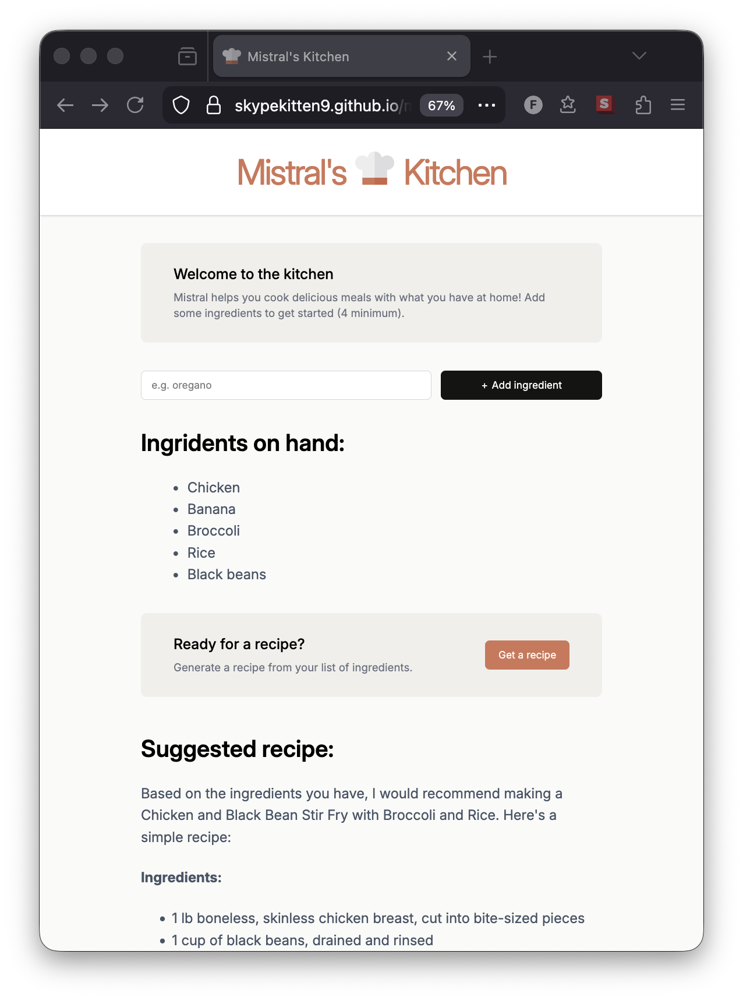

# Mistral's Kitchen

A small recipe-building web app built with React, TypeScript and Vite.

Mistral helps create recipes with ingredients you have at home.



## Tech stack
- Frontend: React + TypeScript
- Bundler: Vite

## Features
- Ingredient form with validation
- UI components/containers seperation 
- Stylish & resizable!

## Quick Start
1. Install dependencies:

```bash
npm install
```

2. Run the dev server:

```bash
npm run dev
```

3. Build for production:

```bash
npm run build
```

4. Preview the production build:

```bash
npm run preview
```

**Project Structure (important paths)**
- `src/` — application source code
- `src/components/` — UI components (forms, header, list, sections)
- `src/lib/appwrite.ts` — Appwrite integration helper (if you use Appwrite)
